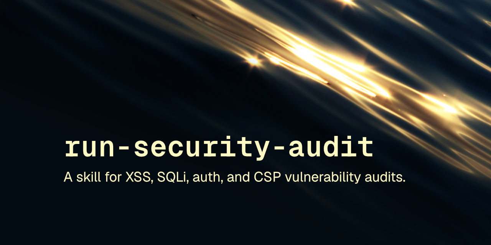

<p align="center"></p>

# sentinel

Security skill scans code. XSS, SQLi, auth gaps found. File:line evidence + fix, not vibes.

[](LICENSE) [](https://skills.sh/robcsaszar/sentinel)

A static security audit skill for web application codebases: stack triage, checklist-driven scan, and a PASS/FAIL/MANUAL-REVIEW report with file:line evidence and remediation code.

These skills follow the [Agent Skills specification](https://agentskills.io/specification) so they can be used by any skills-compatible agent.

## Installation

### npx skills

```
npx skills add robcsaszar/sentinel
```

### Marketplace

```
/plugin marketplace add robcsaszar/sentinel
/plugin install robcsaszar-sentinel@sentinel
```

### Manually

Copy the `skills/` directory into your project's `.claude/skills/`.

## Skill

`sentinel` runs a rigorous static security audit of a web application codebase. It starts with a stack triage phase (framework, database driver, auth mechanism, deploy target, file uploads, outbound calls), then works through a category checklist, reading real source rather than working from memory. The output is a summary table (PASS / FAIL / MANUAL-REVIEW) followed by evidence-backed finding blocks with file:line citations and remediation code that matches the project's actual framework and libraries. Use it for a security audit, a pre-release or pre-pen-test scan, or a vulnerability review.

## License

[MIT](LICENSE) © Rob Csaszar
